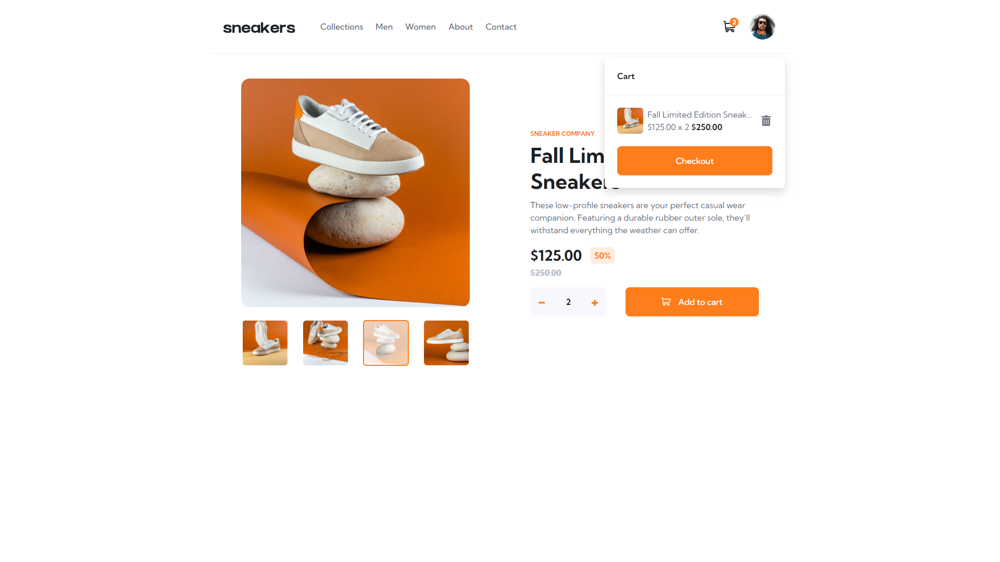

# Frontend Mentor - E-commerce product page solution

This is a solution to the [E-commerce product page challenge on Frontend Mentor](https://www.frontendmentor.io/challenges/ecommerce-product-page-UPsZ9MJp6). Frontend Mentor challenges help you improve your coding skills by building realistic projects.

## Table of contents

- [Overview](#overview)
    - [The challenge](#the-challenge)
    - [Screenshot](#screenshot)
    - [Links](#links)
- [My process](#my-process)
    - [Built with](#built-with)
    - [What I learned](#what-i-learned)
- [Author](#author)

## Overview

### The challenge

Users should be able to:

- View the optimal layout for the site depending on their device's screen size
- See hover states for all interactive elements on the page
- Open a lightbox gallery by clicking on the large product image
- Switch the large product image by clicking on the small thumbnail images
- Add items to the cart
- View the cart and remove items from it

### Screenshot

### Links

- Solution URL: [https://github.com/grzeg95/ecommerce-product-page/](https://github.com/grzeg95/ecommerce-product-page/)
- Live Site URL: [https://ecommerce-product-page.fm.grzeg.pl/](https://ecommerce-product-page.fm.grzeg.pl/)

## My process

### Built with

- Angular
- Bootstrap
- Swiper

### What I learned

- Swiper
- Bootstrap Flex, Fonts, Spacing
- DOMPurify
- Storing SVGs before page is loaded
- Angular Animations

## Author

- Frontend Mentor - [@grzeg95](https://www.frontendmentor.io/profile/grzeg95)
